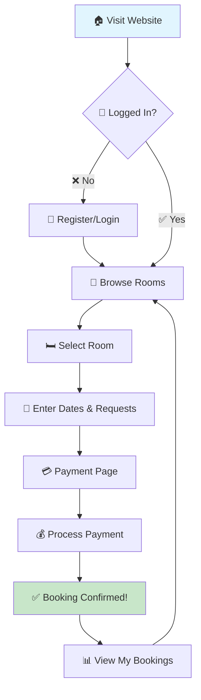

# 🏨 Hotel Reservation System

> A modern web-based hotel room booking application built with Flask and MySQL, enabling seamless user registration, room browsing, booking management, and payment processing. Perfect for small to medium-sized hotels! ✨

## 🌟 Key Features

| Feature | Description | Emoji |
|---------|-------------|-------|
| 🔐 User Authentication | Secure registration and login system | 🔑 |
| 🏠 Room Management | View available rooms with detailed info (type, price, floor) | 🛏️ |
| 📅 Booking System | Book rooms with check-in/check-out dates and special requests | 📝 |
| 💳 Payment Processing | Simulate payments with multiple methods (Card, UPI, etc.) | 💰 |
| 📊 Booking History | View all past and current bookings | 📈 |
| 📱 Responsive Design | Clean, mobile-friendly interface | 📱 |

## 🛠️ Tech Stack

### Backend Technologies
| Technology | Version | Purpose |
|------------|---------|---------|
| 🐍 Python | 3.7+ | Core programming language |
| 🌶️ Flask | Latest | Web framework for routing and templates |
| 🗄️ MySQL | 8.0+ | Database management system |
| 🔗 mysql-connector-python | Latest | Database connectivity library |

### Frontend Technologies
| Technology | Purpose | Emoji |
|------------|---------|-------|
| 🌐 HTML5 | Markup structure | 📄 |
| 🎨 CSS3 | Styling and layout | 🎨 |
| 🧩 Jinja2 | Template engine (Flask built-in) | 🧩 |

### Database Schema Overview
| Table | Purpose | Key Fields |
|-------|---------|------------|
| 👥 Guests | User information | name, email, phone, address, id_proof |
| 🏠 Rooms | Room inventory | type, price, status, floor |
| 📅 Bookings | Reservation records | guest_id, room_id, check_in, check_out, requests |
| 💳 Payments | Transaction tracking | booking_id, amount, method, date |

## � Project Structure

Here's the complete file structure of the Hotel Reservation System:

```
🏨 hotel-reservation-system/
├── 📄 app.py                    # Main Flask application with routes and logic
├── 📄 index.html               # Static landing page
├── 📄 setup_db.py              # Database initialization and table creation
├── 📄 tablecreation.txt        # Database schema documentation
├── 📄 update_db.py             # Database update and maintenance scripts
├── 📁 static/
│   └── 🎨 style.css            # CSS stylesheets for responsive design
└── 📁 templates/
    ├── 🏠 index.html           # Homepage with room listings
    ├── 🔐 login.html           # User authentication page
    ├── 📝 register.html        # New user registration form
    ├── 🛏️ book_room.html       # Room selection and booking form
    ├── 📊 bookings.html        # User's booking history dashboard
    ├── 💳 payment.html         # Payment method selection and processing
    └── ✅ success.html         # Booking confirmation and success page
```

### 📂 Directory Explanations

| Directory/File | Purpose | Key Components |
|---------------|---------|----------------|
| 📄 `app.py` | **Core Application** | Flask routes, database connections, business logic |
| 📄 `setup_db.py` | **Database Setup** | Table creation, initial data population |
| 📁 `static/` | **Assets** | CSS files, images, JavaScript (if any) |
| 📁 `templates/` | **HTML Templates** | Jinja2 templates for dynamic web pages |
| 📄 `*.html` | **Static Files** | Additional static pages or documentation |

## �🚀 Quick Start Installation

### Prerequisites Checklist
- ✅ Python 3.7 or higher
- ✅ MySQL Server installed and running
- ✅ Git for version control

### Step-by-Step Setup

1. **📥 Clone the Repository**
   ```bash
   git clone https://github.com/yourusername/hotel-reservation-system.git
   cd hotel-reservation-system
   ```

2. **📦 Install Dependencies**
   ```bash
   pip install flask mysql-connector-python
   ```

3. **🗄️ Setup Database**
   - Start your MySQL server
   - Update database credentials in `app.py` and `setup_db.py`
   - Run the setup script:
     ```bash
     python setup_db.py
     ```

4. **▶️ Launch the Application**
   ```bash
   python app.py
   ```

5. **🌐 Access Your App**
   - Open browser: `http://localhost:5000`
   - Start booking rooms! 🎉

## 📋 User Workflow

### Booking Process Flowchart



### How to Use the App

1. **👤 Register**: Create your account with personal details
2. **🔑 Login**: Sign in with your email and password
3. **🏨 Explore**: Browse available rooms on the homepage
4. **📅 Book**: Select your dates and add special requests
5. **💳 Pay**: Choose payment method and complete transaction
6. **📊 Track**: View your booking history anytime

## 🗂️ Database Structure Details

The system uses a relational MySQL database with normalized tables:

- **👥 Guests Table**: Stores user registration data
- **🏠 Rooms Table**: Contains room inventory (Single: $1500, Double: $2500, Suite: $4000)
- **📅 Bookings Table**: Links guests to rooms with dates and requests
- **💳 Payments Table**: Records all financial transactions

## ⚙️ Configuration & Security

### 🔧 Configuration Settings
- **Database**: Update connection details in `app.py` and `setup_db.py`
- **Secret Key**: Change Flask secret key for production security
- **Port**: Default port 5000 (configurable in `app.py`)

### 🔒 Security Best Practices
- ⚠️ **Note**: Passwords stored in plain text (demo only!)
- 🔐 Use bcrypt or similar for password hashing in production
- 🌐 Implement HTTPS for secure data transmission
- 🛡️ Validate and sanitize all user inputs
- 🔑 Use environment variables for sensitive data

## 🤝 Contributing

We welcome contributions! Here's how:

1. 🍴 Fork the repository
2. 🌿 Create feature branch: `git checkout -b feature/AmazingFeature`
3. 💾 Commit changes: `git commit -m 'Add AmazingFeature'`
4. 📤 Push to branch: `git push origin feature/AmazingFeature`
5. 🔄 Open a Pull Request

## 📄 License

This project is licensed under the MIT License - see the [LICENSE](LICENSE) file for details.

## 🚀 Future Roadmap

- 📧 Email notifications for bookings
- 👨‍💼 Admin dashboard for room management
- 💳 Real payment gateway integration
- 👤 User profile management
- 📅 Interactive availability calendar
- 🌍 Multi-language support
- 📱 Mobile app companion

---

**Made with ❤️ for hassle-free hotel bookings!**
